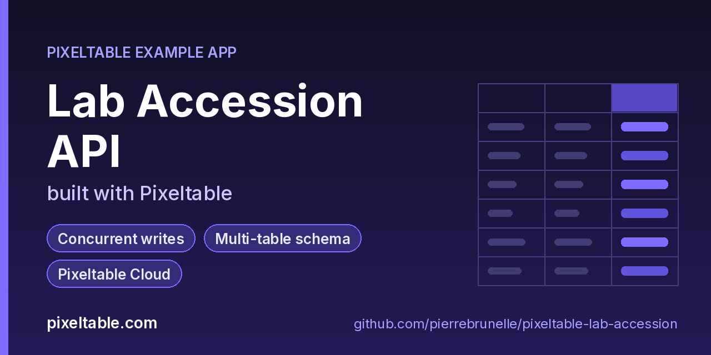

<!-- pixeltable-example-app: 20260928-lab-accession -->
# Lab Accession API built with Pixeltable



[](https://codespaces.new/pierrebrunelle/pixeltable-lab-accession?quickstart=1)
[](https://pixeltable.com)
[](https://pypi.org/project/pixeltable/)
[](https://github.com/pixeltable/pixeltable)
[](LICENSE)

A laboratory accession queue: **stations** process **samples**, and **assignments** route a sample to a station with a priority and a delay. Pixeltable computes an urgency band per assignment, and the API lets technicians claim work. The included client fires parallel sample and assignment inserts and races several technicians claiming the same assignment, a quick way to see how Pixeltable behaves under **concurrent HTTP writers** (every write succeeds; for competing updates the last writer wins).

[Pixeltable](https://pixeltable.com) is open-source, Python-native **multimodal AI data infrastructure**: tables, incremental computed columns, UDFs, indexes and serving in one library, running locally or on Pixeltable Cloud.

> ⭐ **Like this example?** Star [pixeltable/pixeltable](https://github.com/pixeltable/pixeltable) on GitHub. It helps other developers find it.

## What this example shows

- **Concurrent writes**: parallel HTTP clients inserting into and updating the same table
- **Multi-table layout and schema evolution** with `pxt schema update`
- **Pixeltable Cloud lifecycle** from the `pxt` CLI (`db`, `schema`, `service`)
- **Incremental computed columns** powered by plain Python UDFs (`@pxt.udf`)
- **B-tree indexes** declared on the model (`__indexes__`) back the lookup queries
- **FastAPI serving**: one `FastAPIRouter` turns tables and `@pxt.query` functions into typed REST routes (insert, update, delete, compute and query) with OpenAPI docs
- **Importable UDF module**: UDFs live in `udfs.py`; tables, queries and routes live together in `app.py` (Pixeltable resolves UDFs by module path)
- **`pixeltable.toml`** declares a local database and a **Pixeltable Cloud** database, so the same code deploys with `pxt db update`

## Concurrency model in this example

- **Parallel inserts** (`client_demo.py` sends 12 samples and 12 assignments at once) all succeed, and every computed column is filled in the same transaction as its row.
- **Racing updates on one primary key** (8 technicians claim the same assignment) all return 200, and the final row reflects one complete update, never a mix of fields from different requests.
- **Multi-table layout:** three table classes in `app.py` share one catalog directory (`lab/stations`, `lab/samples`, `lab/assignments`), and `pxt schema update` creates or migrates them together.

If your workflow needs "first claim wins", add a precondition in your own handler or claim through a status transition you check before updating.

## What's inside

| File | What it is |
|------|------------|
| `.devcontainer/devcontainer.json` | GitHub Codespaces / Dev Container config: Python 3.12, installs `requirements.txt`, forwards port 8000 |
| `.github/social-preview.png` | Social preview image (1280x640) |
| `CITATION.cff` | Citation metadata (authors, license, release date, keywords) |
| `app.py` | The app: tables declared as Python classes, `@pxt.query` functions, and the `FastAPIRouter` routes |
| `client_demo.py` | Parallel accessions and assignments, then 8 technicians racing to claim the same work item |
| `pixeltable.toml` | Project config: the local database plus a Pixeltable Cloud database (sizing, deploy excludes) |
| `seed.py` | Seed stations and a first batch of samples |
| `udfs.py` | Pixeltable UDFs (`@pxt.udf`) in their own importable module, imported by `app.py` |
| `requirements.txt` / `pyproject.toml` | Dependencies (`pixeltable[serve]>=0.7.14`) |

**Tables**

| Table | Stored columns | Computed columns |
|-------|---------|------------------|
| `stations` | `station_id`, `name`, `capacity` | `label` |
| `samples` | `accession_id`, `specimen`, `priority`, `received_at`, `batch_code` | `priority_label` |
| `assignments` | `accession_id`, `station_id`, `priority`, `delayed_min`, `status`, `claimed_by` | `id`, `urgency` |

**API routes** (service `lab_api`)

| Method | Path | Kind | Backed by | Notes |
|--------|------|------|-----------|-------|
| `POST` | `/stations` | insert | `Stations` |  |
| `POST` | `/samples` | insert | `Samples` |  |
| `POST` | `/assignments` | insert | `Assignments` |  |
| `POST` | `/assignments/claim` | update | `Assignments` |  |
| `POST` | `/urgency` | compute | `Assignments` |  |
| `GET` | `/stations/queue` | query | `station_queue` |  |
| `GET` | `/batches` | query | `batch` |  |

## Run in your browser (GitHub Codespaces)

[](https://codespaces.new/pierrebrunelle/pixeltable-lab-accession?quickstart=1)

1. Click **Open in GitHub Codespaces** above (or [this link](https://codespaces.new/pierrebrunelle/pixeltable-lab-accession?quickstart=1)). The dev container installs Python 3.12 and `pixeltable[serve]>=0.7.14` from `requirements.txt`.
2. In the codespace terminal, create the tables, seed them and start the API:

   ```bash
   pxt schema update app.py lab
   python seed.py lab
   pxt service run app.py lab --port 8000   # open http://localhost:8000/docs
   python client_demo.py                   # in another terminal: parallel writers + claim race
   ```

3. Codespaces forwards port 8000: open it from the **Ports** tab (or the pop-up) and add `/docs` to the URL for the interactive OpenAPI docs.

## Quickstart

Requires Python 3.11+ and `pixeltable[serve]>=0.7.14`.

```bash
git clone https://github.com/pierrebrunelle/pixeltable-lab-accession.git
cd pixeltable-lab-accession
python -m venv .venv && source .venv/bin/activate
pip install -r requirements.txt

# Create the tables in a local catalog directory named `lab`
pxt schema update app.py lab

python seed.py lab
pxt service run app.py lab --port 8000   # open http://localhost:8000/docs
python client_demo.py                   # in another terminal: parallel writers + claim race
```

Try it:

```bash
curl -s -X POST localhost:8000/urgency -H 'Content-Type: application/json' -d '{"priority": 3, "delayed_min": 25}'
curl -s 'localhost:8000/stations/queue?station_id=CHEM-2'
```

## Deploy to Pixeltable Cloud

The same `app.py` runs on [Pixeltable Cloud](https://pixeltable.com). Sign in (or get a free trial database with `pxt new`), point the second database entry in `pixeltable.toml` at your own database, then deploy:

```bash
pxt login                       # or: export PIXELTABLE_API_KEY=<your-api-key>
# edit pixeltable.toml: name = 'pxt://<your-org>:<your-db>'
pxt db update pxt://<your-org>:<your-db>                 # build the image and upload the project
pxt schema update app.py pxt://<your-org>:<your-db>/lab   # create the tables in the hosted database
pxt service update app.py pxt://<your-org>:<your-db>/lab  # start the API there
pxt service list pxt://<your-org>:<your-db>              # list hosted services
```

Hosted routes require an API key: send it in the `X-api-key` header (for example `-H "X-api-key: $PIXELTABLE_API_KEY"`). Keep keys in environment variables or `pxt secret set`, never in code.

## Code walkthrough

**1. Business logic is plain Python, in `udfs.py`.** A `@pxt.udf` function can be used as a column expression. Pixeltable records UDFs by module path (`udfs.priority_name`), so they live in their own importable module rather than inline in the app: the daemon, serving workers and Pixeltable Cloud import it again by that path.

```python
# udfs.py
@pxt.udf
def priority_name(priority: int) -> str:
    return {1: 'routine', 2: 'urgent', 3: 'stat'}.get(priority, 'routine')
```

**2. Tables are Python classes (`app.py`).** Annotated attributes are stored columns; attributes assigned an expression are **computed columns** (`id`, `urgency`), evaluated incrementally on every insert or update and recomputed when their inputs change. Indexes live next to the columns.

```python
# app.py
class Assignments(TableModel, name='assignments', has_default_idxs=False):
    id = pxt.Column(value=pxtf.uuid.uuid7(), primary_key=True)
    accession_id: pxt.String
    station_id: pxt.String
    priority: pxt.Int
    delayed_min: pxt.Int
    status: pxt.String
    claimed_by: pxt.String | None

    urgency = urgency_band(priority, delayed_min)

    __indexes__ = [pxt.BtreeIndex(station_id), pxt.BtreeIndex(status)]
```

**3. Queries are functions (`app.py`).** `@pxt.query` wraps a Pixeltable query so it can be called from Python or exposed as a route:

```python
# app.py
@pxt.query
def station_queue(station_id: str):
    """Work for one station, most urgent first."""
    return Assignments.where(Assignments.station_id == station_id).select(
        Assignments.id, Assignments.accession_id, Assignments.urgency, Assignments.status, Assignments.claimed_by
    ).order_by(Assignments.priority, asc=False)
```

**4. One router, a full REST API.** `FastAPIRouter` generates request/response models from the column types, validates input, and publishes OpenAPI docs at `/docs`:

```python
# app.py
lab_api = FastAPIRouter(name='lab_api')
lab_api.add_insert_route(Stations, path='/stations', inputs=[Stations.station_id, Stations.name, Stations.capacity],
                         outputs=[Stations.station_id, Stations.label])
lab_api.add_insert_route(Samples, path='/samples',
                         inputs=[Samples.accession_id, Samples.specimen, Samples.priority, Samples.received_at,
                                 Samples.batch_code],
                         outputs=[Samples.accession_id, Samples.priority_label])
lab_api.add_insert_route(Assignments, path='/assignments',
                         inputs=[Assignments.accession_id, Assignments.station_id, Assignments.priority,
                                 Assignments.delayed_min, Assignments.status, Assignments.claimed_by],
                         outputs=[Assignments.id, Assignments.urgency])
lab_api.add_update_route(Assignments, path='/assignments/claim', inputs=[Assignments.status, Assignments.claimed_by],
                         outputs=[Assignments.id, Assignments.status, Assignments.claimed_by])
lab_api.add_compute_route(Assignments, path='/urgency', inputs=[Assignments.priority, Assignments.delayed_min],
                          outputs=[Assignments.urgency])
lab_api.add_query_route(path='/stations/queue', query=station_queue, method='get')
lab_api.add_query_route(path='/batches', query=batch, method='get')
```

## Learn more

- 🌐 Website: https://pixeltable.com
- 📚 Docs: https://docs.pixeltable.com
- 💻 Source: https://github.com/pixeltable/pixeltable (⭐ star it if Pixeltable is useful to you)
- 📦 PyPI: https://pypi.org/project/pixeltable/
- 🧩 More example apps: https://pierrebrunelle.github.io/awesome-pixeltable-apps/

**[More Pixeltable example apps →](https://pierrebrunelle.github.io/awesome-pixeltable-apps/)**

---

<sub>Built as part of a daily series of Pixeltable example apps · Pixeltable 0.7.14 · Python, FastAPI, incremental computed columns · Licensed under Apache-2.0.</sub>
